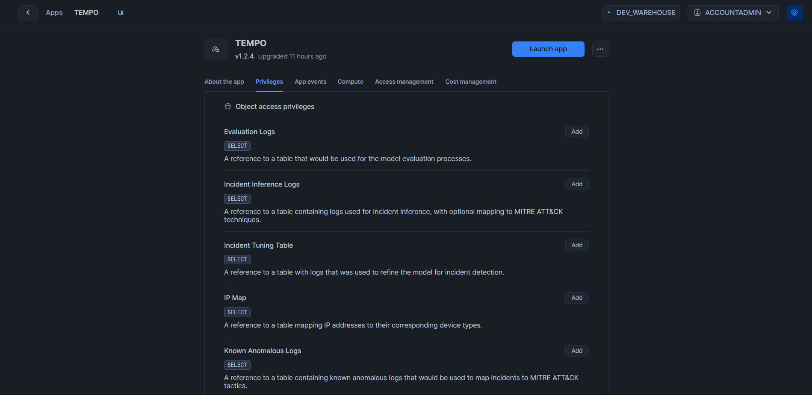

# Fine-tune Model

To access fine-tuning features, contact support@DeepTempo.ai for activation.

#### When to Consider Fine-Tuning

Our baseline model provides robust performance across many use cases. However, fine-tuning can be beneficial in specific scenarios:

#### Performance Evaluation Workflow

1. Initial Assessment
   - Start by testing the baseline model on a representative subset of your data using the [Evaluation function](#performance-evaluation)
   - Collect performance metrics:
     - Accuracy rate
     - F1 Score
     - Recall

2. Decision Criteria for Fine-Tuning
   - Consider fine-tuning if:
     - Baseline model accuracy falls below 85-90%
     - Low F1 Score
     - Critical domain-specific patterns are consistently missed

### Computational Considerations

#### Fine-Tuning Resource Requirements

- Estimated Compute Time and Expense:

  | **Dataset Size**      | **Estimated Time (hours)** | **Compute Cost (Credits)** |
  |-----------------------|---------------------------|----------------------------|
  | Small (1-100k samples)  | ~ 0.01 - 0.05          |      ~0.0095               |
  | Medium (100k-1M samples)| ~ 0.05 - 0.1           | ~0.05              |
  | Large (1M+ samples)  |  > 0.1                    | > 0.1                |
 
- Resources in use: 
  - Compute Pool: GPU_NV_S (0.57 CpH)
  - Warehouse size : Medium (4 CpH)

> **Note:** *[CpH](https://www.snowflake.com/legal-files/CreditConsumptionTable.pdf) refers to credits per hour* 

### Performance Evaluation

You can evaluate model performance using the `CALL MODEL_OPTIMIZATION.EVALUATE_PERFORMANCE();` function after assigning a table with labeled data to the evaluation reference in the reference table.

1. Assign a labeled data table to the evaluation reference within the reference table.  

2. Run the `MODEL_OPTIMIZATION.EVALUATE_PERFORMANCE()` procedure to generate performance metrics based on the assigned data.

```sql
CALL MODEL_OPTIMIZATION.EVALUATE_PERFORMANCE();
```

You would obtain a table of performance metrics including F1 Score, Recall, and Accuracy:

| Metric   | Value |
|----------|-------|
| Accuracy | 0.95  |
| F1 Score | 0.92  |
| Recall   | 0.90  |

# Fine-tuning the Model

If you want to increase the accuracy by tuning the model to your own network you can use the following commands.

```sql
CALL MODEL_OPTIMIZATION.TUNE_MODEL();
```

Purpose: Updates model based on tuning log data from the reference page as shown in the screenshot



### Model Rollback
```sql
CALL INFRA_CONTROLS.MODEL_ROLLBACK(int);
```
Removes the specified version of the model and its metadata from the app.

**Parameters:**  
- `version`: The integer version number of the model to be rolled back.

**Usage Example:**  
```sql
CALL INFRA_CONTROLS.MODEL_ROLLBACK(3);
```

⚠️ **WARNING: THIS ACTION IS PERMANENT AND IRREVERSIBLE!** ⚠️  
Rolling back will **permanently delete** all model versions after the specified version. Proceed with extreme caution.
