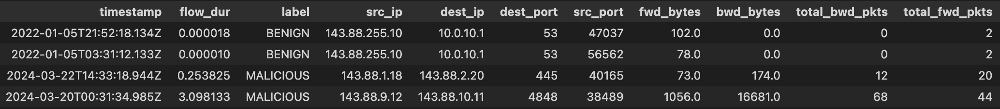

# Use Your Own Data

To run inference on your dataset, please ensure the following features are listed

| **Feature**        | **Description**                                                                                                |
|--------------------|----------------------------------------------------------------------------------------------------------------|
| **timestamp**      | String datetime when flow started such as "2017-03-07 08:55:58"                                                |
| **flow_dur**       | The duration of the flow in **seconds**                                                                        |
| **src_ip**         | A unique identifier of the source device initiating the flow                                                   |
| **dest_ip**        | A unique identifier of the destination device receiving the flow                                               |
| **src_port**       | Source port                                                                                                    |
| **dest_port**      | Destination port                                                                                               |
| **fwd_bytes**      | Total number of payload bytes, sent from source to destination                                                 |
| **bwd_bytes**      | Total number of payload bytes, sent from destination to source                                                 |
| **total_fwd_pkts** | Total number of packets sent from source to destination                                                        |
| **total_bwd_pkts** | Total number of packets sent from destination to source                                                        |
| **label**          | Required if fine-tuning. Indicates if flow is suspicious marked as 1 or if normal marked as 0                  |

The above features can be exported from network monitoring tools such as NetFlow, Wireshark, Zeek, SolarWinds or AWS/GCP Flow logs

#### sample input data



## Adding a uid-device mapping
If the device type of the uids/IPs provided in the 'src_ip' or 'dest_ip' is known, it can be categorized into one of 
the following: 

| **Device Type** | **Description**                                                           |
|-----------------|---------------------------------------------------------------------------|
| **workstation** | endpoint devices used by individuals such as desktop or laptops           |
| **webserver**   | servers that hosts and delivers web content or application via HTTP/HTTPS |
| **ubuntu**      | linux based servers or other servers in organization                      |
| **firewall**    | network security devices                                                  |
| **dns**         | domain name servers                                                       |

Providing a uid to device mapping can help enhance the resulting output by providing more information into how 
certain device types operate within your network

For advanced operations it may be useful to use Tempo itself to resolve entities; if you are interested in this and other approaches to improving the accuracy and usefulness of Tempo, please reach out.

#### sample uid-device mapping
```json
{
    "192.x.x.3": "dns",
    "192.x.x.50": "webserver",
    "205.x.x.68": "webserver",
    "192.x.x.51": "ubuntu",
    "205.x.x.66": "ubuntu",
    "192.x.x.17": "firewall",
    "192.x.x.16": "firewall",
    "192.x.x.9": "workstation",
    "192.x.x.5": "workstation",
    "192.x.x.8": "workstation",
    "192.x.x.14": "workstation",
    "195.x.x.55": "dns",
    "68810583-72a000813f68": "dns",
    "cff90ebf-cd24": "webserver"
}
```

### Understanding the result
| **Feature**        | **Description**                                                                                    |
|--------------------|----------------------------------------------------------------------------------------------------|
| **start_time**     | The earliest timestamp when the flow started between the `src_ip` and `dest_ip`.                   |
| **end_time**       | The timestamp of the last flow sent from the `src_ip` to the `dest_ip`.                            |
| **src_ip**         | A unique identifier for the source device initiating the flow.                                     |
| **dest_ip**        | A unique identifier for the destination device receiving the flow.                                 |
| **num_connection** | The total number of flows or data points sent between the `src_ip` and `dest_ip`.                  |
| **src_port**       | The port number used by the source device.                                                         |
| **dest_port**      | The port number used by the destination device.                                                    |
| **src_device**     | The device type assigned to the `src_ip` in the UID-device mapping, or `unknown` if not provided.  |
| **dest_device**    | The device type assigned to the `dest_ip` in the UID-device mapping, or `unknown` if not provided. |
| **classification** | The model's result, indicating whether the flow is marked as 'MALICIOUS' or 'BENIGN'.              |


