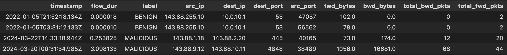

### Using your data
To run inference on your dataset, please ensure the following features are listed
<!-- updates to make (get josiah inputs)-->
<!-- should we use flow or event to describe a data point? -->
<!-- does returning an output showing each ip_ip connection give away our sequence generation? -->
<!-- update output to show just the malicious -->

| Features       | Description                                                                                                    |
|----------------|----------------------------------------------------------------------------------------------------------------|
| timestamp      | String datetime when flow started such as "2017-03-07 08:55:58"                                                |
| flow_dur       | The duration of the flow in **seconds**                                                                        |
| src_ip         | A unique identifier of the source device initiating the flow                                                   |
| dest_ip        | A unique identifier of the destination device receiving the flow                                               |
| src_port       | Source port                                                                                                    |
| dest_port      | Destination port                                                                                               |
| fwd_bytes      | Total number of payload bytes, sent from source to destination                                                 |
| bwd_bytes      | Total number of payload bytes, sent from destination to source                                                 |
| total_fwd_pkts | Total number of packets sent from source to destination                                                        |
| total_bwd_pkts | Total number of packets sent from destination to source                                                        |
| label          | Required if fine-tuning. Indicates if flow is suspicious marked as 'MALICIOUS' or if normal marked as 'BENIGN' |

The above features can be exported from network monitoring tools such as NetFlow, Wireshark, Zeek, SolarWinds or AWS/GCP Flow logs

  
  
<strong>Figure 1:</strong> Sample input data

#### Adding a uid-device mapping
If the device type of the uids/IPs provided in the 'src_ip' or 'dest_ip' is known, it can be categorized into one of 
the following: 

| Device Type | Description                                                               |
|-------------|---------------------------------------------------------------------------|
| workstation | endpoint devices used by individuals such as desktop or laptops           |
| webserver   | servers that hosts and delivers web content or application via HTTP/HTTPS |
| ubuntu      | linux based servers or other servers in organization                      |
| firewall    | network security devices                                                  |
| dns         | domain name servers                                                       |

Providing a uid to device mapping can help enhance the resulting output by providing more information into how 
certain device types operate within your network

<!-- give description of output results esp start_time, end_time, num_connection (prob ask josiah) -->
<!-- add picture of sample output it should be one from a SF run -->

