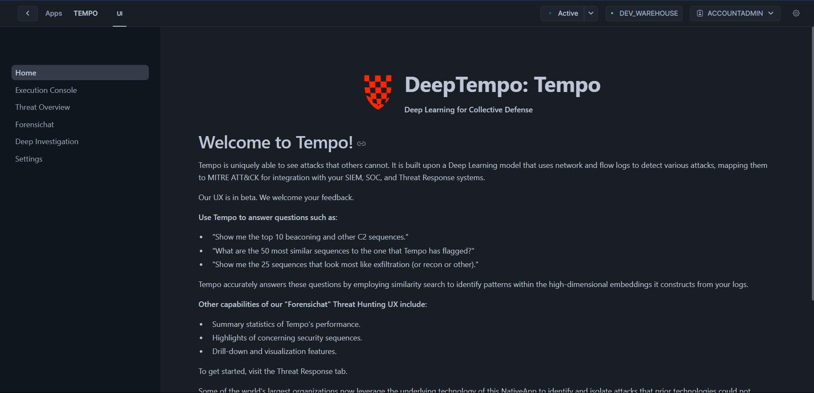

# ForensicChat Guide

## Overview
ForensicChat is a cybersecurity analysis platform integrated within Tempo that helps security analysts investigate network traffic and identify potential threats. It leverages deep learning technology to analyze patterns and anomalies in network data, providing deeper insights than traditional rule-based systems.



## Prerequisites
Before using ForensicChat, ensure the Tempo app has been properly initialized and that you have granted the necessary permissions as outlined in the Snowflake Quickstart Guide. You will also need to run the inference as shown in the Quickstart Guide in order for there to be any data to analyze.

## 1. Accessing ForensicChat

To access and use ForensicChat, follow these steps:

1. Navigate to the Tempo app in your Snowflake instance. Generally under data products > apps > Tempo.
2. The ForensicChat interface will load, showing the available features and options.

## 2. Using the Forensic Analysis Assistant

The Forensic Analysis Assistant allows you to perform natural language queries against your network data:


```sql
-- To use the Forensic Analysis Assistant, simply enter your query in the text field
-- No SQL command is needed as this is done through the UI
```

### Purpose
This feature enables security analysts to ask questions about network behavior and potential security incidents in natural language, making advanced forensic analysis more accessible.

## 3. Available Features

ForensicChat includes several built-in capabilities:

1. **MITRE ATT&CK Framework Analysis**: Categorize threats according to industry standards, mapping detected anomalies to known adversarial tactics and techniques.

2. **Network Traffic Visualization**: Monitor traffic patterns over time to identify unusual activity that may indicate a security incident.

3. **Threat Overview**: Get a high-level view of potential security incidents, showing metrics like:
   - Unique IP Connections
   - Total Network Events
   - Potential Anomalies
   - MITRE ATT&CK Framework Distribution
   
   

4. **Deep Investigation**: Perform detailed forensic analysis on specific connections that have been flagged as suspicious.
   
   

## 4. Usage Toggles

ForensicChat provides several filtering options that can be enabled or disabled according to your analysis needs:


1. **Ignore Unclassified MITRE Tactics**: Filter out events that couldn't be mapped to MITRE tactics.
2. **Ignore Unclassified Events**: Filter out events that couldn't be classified.
3. **Ignore Benign Flows**: Filter out network flows classified as normal.
4. **Ignore Anomalous Flows**: Filter out flows classified as anomalous (useful when focusing on specific known patterns).

## 5. Creating New Queries

To create a new analysis query:

1. Click the **New Query** button in the Forensic Analysis Assistant interface.
2. Enter your question in natural language (e.g., "What suspicious activities occurred between 192.168.1.10 and external IPs last week?").
3. Click **Analyze Query** to process your request.


## Notes
- ForensicChat works best when MITRE classification has been run on your data (using `CALL THREAT_INTELLIGENCE.MITRE_TACTIC_CLASSIFICATION()` as outlined in the [MITRE Classification Guide](./mitreclass.md)).
- The effectiveness of analysis depends on the quality and quantity of data available to the system.
- For detailed investigation of specific anomalies, use the sequence ID with `CALL INSPECT.INVESTIGATE_SEQUENCE(sequence_id:int)` as outlined in the Deep Dive Analysis section of the [Snowflake Quickstart Guide](./snowflake.md).
- For a complete list of available commands, refer to the [Snowflake Command Reference](./snow_commandRef.md).
- If using your own data, ensure it includes the required features as specified in the [SF Features Guide](./SF_features.md).