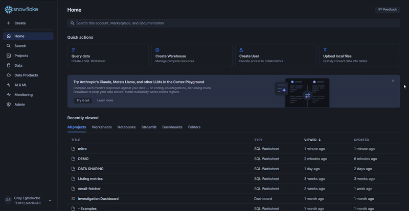

# MITRE ATT&CK Classification Guide  

## Overview  
MITRE ATT&CK classification enables mapping of detected anomalies to known adversarial tactics and techniques. This guide walks you through the setup and execution of MITRE classification on Snowflake.  

## Prerequisites  
Before running the classification, ensure the Tempo app has the necessary permissions to access your data.  

## 1. Granting Data Access  

To allow Tempo to classify known anomalies, follow these steps to grant access:  

  

1. Navigate to the **Data Products** tab in the Snowflake sidebar.  
2. Click on the **Apps** dropdown to view installed applications.  
3. Locate and select **Tempo** from the list.  
4. On the **Tempo App Overview** page, go to the **Privileges** section.  
5. Find the section labeled **Known Anomalous Logs** and click the **Add** button.  
6. Select the appropriate **Database, Schema, and Table or View** for classification.  
7. Click **Save**, then use the **Back** button on the top left to return.  
8. Navigate to a **Worksheet** of your choice to proceed with classification.  

Note: If no reference is specified, the application will default to its demo data.

## 2. Running MITRE Classification  

To classify detected anomalies using MITRE ATT&CK mappings, execute the following SQL command in your worksheet:  

```sql
CALL THREAT_INTELLIGENCE.MITRE_TACTIC_CLASSIFICATION();
```

### Purpose  
This procedure analyzes known anomalous logs and maps them to relevant MITRE ATT&CK tactics and techniques for deeper security insights.  

### Viewing Classification Results

After running the classification procedure, you can view the results by querying the output table:

```sql
SELECT * FROM TEMPO.THREAT_INTELLIGENCE.MITRE_TACTICS_MAPPINGS
```

## Notes  
- Ensure proper reference assigning for table access.  
- Classification results will be available in your output table for further investigation.  
