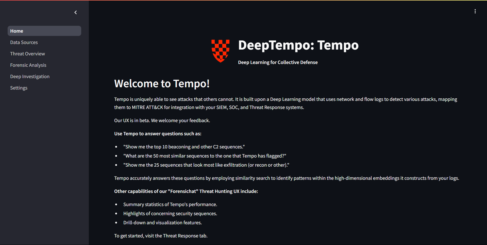
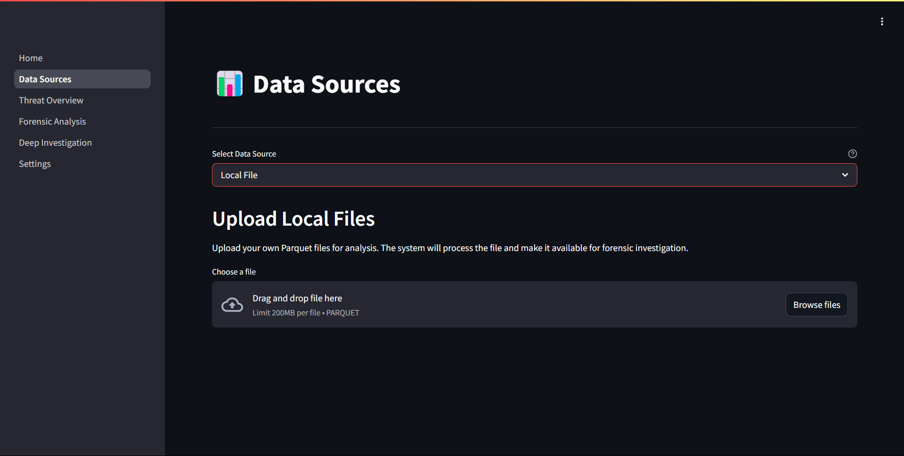
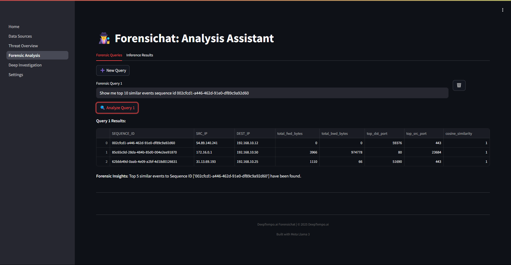
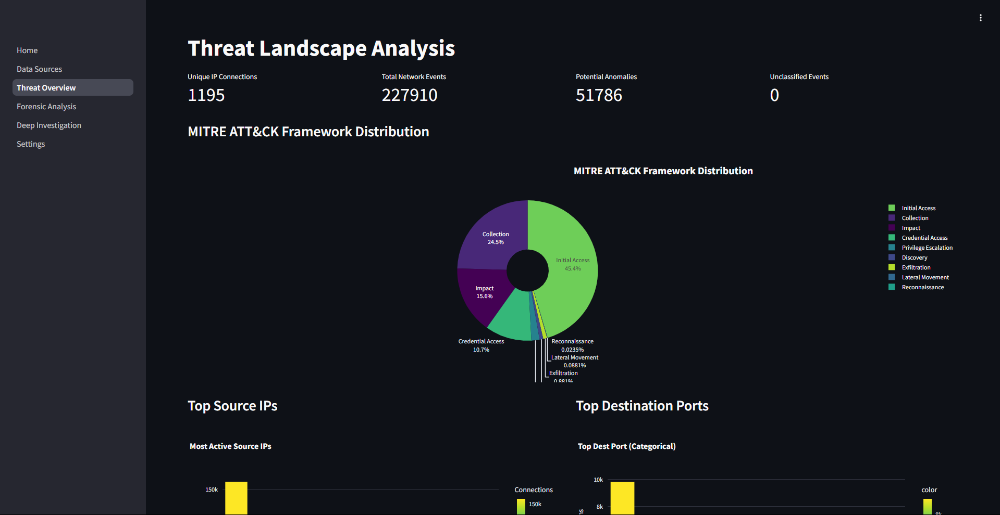
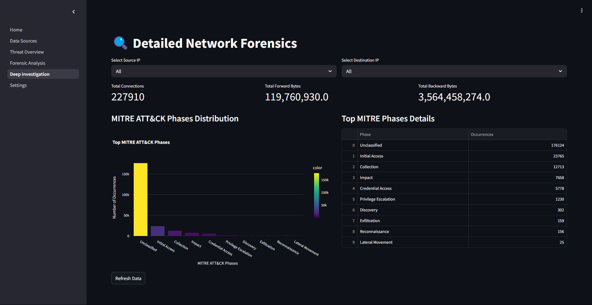
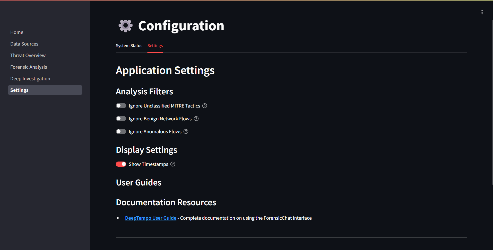

# Guide

## Overview
Forensichat is a cybersecurity analysis platform integrated within Tempo that helps security analysts investigate network traffic and identify potential threats. It leverages deep learning technology to analyze patterns and anomalies in network data, providing deeper insights than traditional rule-based systems.

## Prerequisites
You will also need to run the inference as shown here in order for there to be any data to analyze.

## 1. Accessing Forensichat

To access and use Forensichat, follow these steps:

1. Navigate to the Tempo app URL. This would have been configured by you during install.
2. The Forensichat interface will load, showing the available features and options.

## 2. Running inference:

- Select your data source from the data sources tab and follow the steps in the UI to add your data source. 
- Once the data source is added run the inference step to proccess it. 

**Monitor Status**  
   - Watch the status indicator above the button:  
     - ⏳ *Running* (auto-polls every 5 s)  
     - ✅ *Completed*  
     - ❌ *Failed*

**View Results**  
   - Once completed, you can view the resuts in the *Threat Overview*  and *Deep Investigation* tabs.

## 3. Using the Forensic Analysis Assistant

The Forensic Analysis Assistant allows you to perform natural language queries against your network data:
This feature enables security analysts to ask questions about network behavior and potential security incidents in natural language, making advanced forensic analysis more accessible.

To create a new analysis query:

1. Click the **New Query** button in the Forensic Analysis Assistant interface.
2. Enter your question in natural language (e.g., "What suspicious activities occurred between 192.168.1.10 and external IPs last week?").
3. Click **Analyze Query** to process your request.

`Sample Query: Show me top 10 similar events sequence id 982b5a35-d289-46f7-8adb-6aea0936b1c2`

## 4. Available Features

Forensichat includes several built-in capabilities:

1. **MITRE ATT&CK Framework Analysis**: Categorize threats according to industry standards, mapping detected anomalies to known adversarial tactics and techniques.

2. **Network Traffic Visualization**: Monitor traffic patterns over time to identify unusual activity that may indicate a security incident.

3. **Threat Overview**: Get a high-level view of potential security incidents, showing metrics like:
   - Unique IP Connections
   - Total Network Events
   - Potential Anomalies
   - MITRE ATT&CK Framework Distribution
   
   

4. **Deep Investigation**: Perform detailed forensic analysis on specific connections that have been flagged as suspicious.
   
   

## 5. Settings and Filters
The Tempo application provides customizable filtering and display options to tailor forensic investigations to specific analytical needs.

The following toggles allow users to control which types of events or flows are shown in the visualization and downstream analyses:

| Toggle | Description |
|--------|-------------|
| **Ignore Unclassified MITRE Tactics** | Hides events that could not be mapped to any MITRE ATT&CK tactic, enabling users to concentrate on recognized adversarial behavior patterns. |
| **Ignore Benign Network Flows** | Excludes network flows flagged as benign or normal, reducing noise in the data and helping to isolate potentially suspicious traffic. |
| **Ignore Anomalous Flows** | Removes network flows labeled as anomalous. This can be useful when users want to focus only on confirmed patterns or known behavior baselines. |

