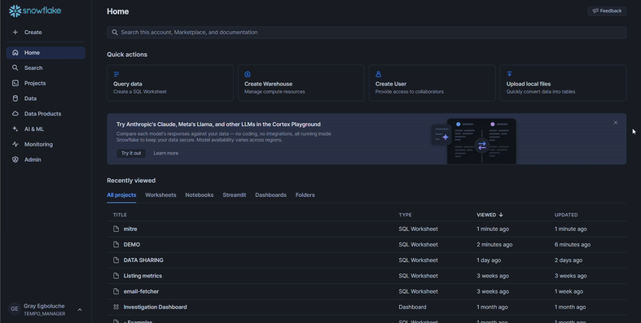
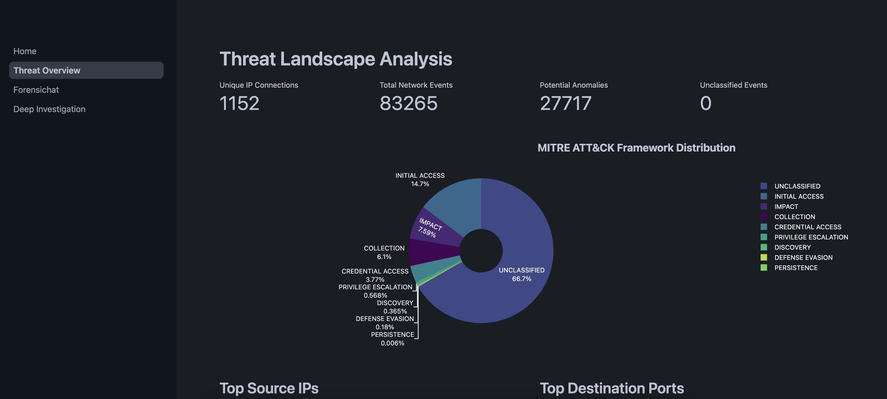

# Guide

## Overview
Forensichat is a cybersecurity analysis platform integrated within Tempo that helps security analysts investigate network traffic and identify potential threats. It leverages deep learning technology to analyze patterns and anomalies in network data, providing deeper insights than traditional rule-based systems.


## Prerequisites
If using Snowflake, ensure the Tempo app has been properly initialized and that you have granted the necessary permissions as outlined in the Snowflake Setup Guide. 

If you want to run Tempo on your own data, follow these steps to select the correct storage before launching the app:  



If you would like to use this demo data, please *skip this step* and continue: 

## 1. Accessing The UI

To access and use Tempo, follow these steps:

1. Navigate to the Tempo app in your Snowflake instance. Generally under data products > apps > Tempo.
2. The Tempo interface will load, showing the available features and options.


## 2. Executing Procedures throught the UI:
This interface enables users to run predefined Tempo procedures directly from the UI inplace of a Snowflake worksheet.


> **⚠️ Note:**  
> - **Inference Procedures** (Incident Classification, Mitre Classification) will default to the demo data tables unless you explicitly configure which table to target under Reference Pages.  
> - **Performance Evaluation** and **Model Fine-Tuning** **require** you to explicitly set the target evaluation or tuning table on the reference page—they have no demo defaults.  
>
> Ensure you have selected or created the correct source tables before executing these procedures, or the command will fail.  


1. **Select Your Procedure**  
   - Click the **Select Procedure** dropdown.  
   - Choose the desired command (e.g. “Investigate Sequence 🔎”, “Incident Classification 🛡️”, etc.).

2. **(Investigate Sequence only) Enter Sequence ID**  
   - If you picked **Investigate Sequence 🔎**, a text field appears.  
   - Type or paste the 29-character NetFlow Sequence ID and press **Enter**.

3. **(Incident Classification only) Toggle MITRE Mapping**  
   - If you picked **Incident Classification 🛡️**, use the **Include MITRE Classification** switch to turn ATT&CK mapping on or off.

4. **Execute the Command**  
   - Click **Execute Command** to launch the procedure.  
   - The button is disabled until all required inputs are valid or until run is completed.

5. **Monitor Status**  
   - Watch the status indicator above the button:  
     - ⏳ *Running* (auto-polls every 5 s)  
     - ✅ *Completed*  
     - ❌ *Failed*

6. **View Results**  
   - Once completed, scroll down to see the output table for your selected procedure:  
     - **Investigate Sequence** shows raw NetFlow rows.  
     - **Incident/Mitre Classification** displays inference logs.  
     - **Performance Evaluation** lists recent metrics.  
     - **Model Fine-Tuning** returns a summary message.

## 3. Using the Forensic Analysis Assistant

The Forensic Analysis Assistant allows you to perform natural language queries against your network data:


`Sample Query: Show me top 10 similar events sequence id 982b5a35-d289-46f7-8adb-6aea0936b1c2`

```
-- To use the Forensic Analysis Assistant, simply enter your query in the text field
-- No SQL command is needed as this is done through the UI
```

### Purpose
This feature enables security analysts to ask questions about network behavior and potential security incidents in natural language, making advanced forensic analysis more accessible.

## 4. Available Features

Forensichat includes several built-in capabilities:

1. **MITRE ATT&CK Framework Analysis**: Categorize threats according to industry standards, mapping detected anomalies to known adversarial tactics and techniques.

2. **Network Traffic Visualization**: Monitor traffic patterns over time to identify unusual activity that may indicate a security incident.

3. **Threat Overview**: Get a high-level view of potential security incidents, showing metrics like:
   - Unique IP Connections
   - Total Network Events
   - Potential Anomalies
   - MITRE ATT&CK Framework Distribution
   
   

4. **Deep Investigation**: Perform detailed forensic analysis on specific connections that have been flagged as suspicious.
   
   

## 5. Creating New Queries

To create a new analysis query:

1. Click the **New Query** button in the Forensic Analysis Assistant interface.
2. Enter your question in natural language (e.g., "What suspicious activities occurred between 192.168.1.10 and external IPs last week?").
3. Click **Analyze Query** to process your request.


## 6. Settings and Filters
The Tempo application provides customizable filtering and display options to tailor forensic investigations to specific analytical needs.


The following toggles allow users to control which types of events or flows are shown in the visualization and downstream analyses:

| Toggle | Description |
|--------|-------------|
| **Ignore Unclassified MITRE Tactics** | Hides events that could not be mapped to any MITRE ATT&CK tactic, enabling users to concentrate on recognized adversarial behavior patterns. |
| **Ignore Benign Network Flows** | Excludes network flows flagged as benign or normal, reducing noise in the data and helping to isolate potentially suspicious traffic. |
| **Ignore Anomalous Flows** | Removes network flows labeled as anomalous. This can be useful when users want to focus only on confirmed patterns or known behavior baselines. |
| **Ignore Unclassified Events** | Filters out events that were not categorized during the detection pipeline, simplifying the visual workspace. |

## Notes
- Forensichat works best when MITRE classification has been run on your data (using `CALL THREAT_INTELLIGENCE.MITRE_TACTIC_CLASSIFICATION()` as outlined in the [MITRE Classification Guide](./mitreclass.md)).
- The effectiveness of analysis depends on the quality and quantity of data available to the system.
- For detailed investigation of specific anomalies, use the sequence ID with `CALL INSPECT.INVESTIGATE_SEQUENCE('sequence_id')` as outlined in the Deep Dive Analysis section of the [Snowflake Quickstart Guide](./snowflake.md).
- For a complete list of available commands, refer to the [Snowflake Command Reference](./snow_commandRef.md).
- If using your own data, ensure it includes the required features as specified in the [SF Features Guide](./SF_features.md).
