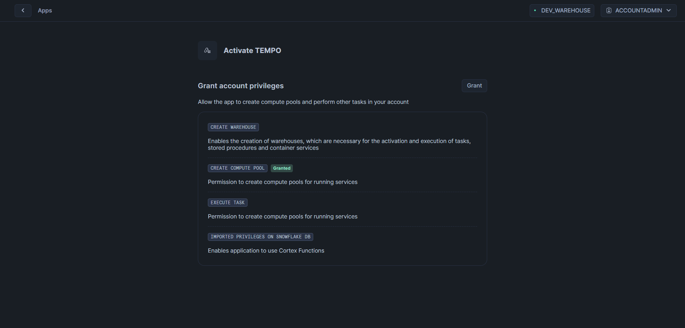

# Snowflake Quickstart Guide

## Overview
In the field of event detection, traditional rule-based systems have dominated for years. While these systems have served their purpose, they come with significant limitations. Their rigid structure makes them inflexible, and their bulky nature often makes them difficult to manage. More importantly, these systems frequently fail to identify critical events, requiring constant manual intervention and maintenance to stay effective.

This guide introduces Tempo, a modern solution that leverages deep learning for incident detection. By moving beyond conventional rule-based approaches, Tempo offers a more sophisticated and adaptable way to identify and respond to events. The following sections will walk you through the setup process and demonstrate how to effectively utilize Tempo's capabilities for your event classification needs.

## Prerequisites
- Grant Tempo necessary permissions including creating necessary warehouses and compute pools.



If you would rather use the Snowflake solution guide you can find it at [this link](https://quickstarts.snowflake.com/guide/getting_started_with_tempo_and_snowflake/index.html#0). 

## 1. Launching the App

### Find The App
In the Snowflake app Marketplace you can find the Tempo app or simply click [Here](https://app.snowflake.com/marketplace/listing/GZTYZOYXHP3/deeptempo-cybersecurity-tempo).  

### Selecting Storage for Tempo Deployment  

If you want to run Tempo on your own data, follow these steps to select the correct storage before launching the app:  


If you would like to use this demo data, please *skip this step* and continue: 

1. Click the **Add** button next to the **on Incident Inference Logs** section.  
2. In the popup window, click **+Select Data**.  
3. From the dropdown menu, find and select the appropriate table.  
4. Click **Save** to confirm your selection.  

Again, make sure you have granted permissions to run Tempo.

Once Tempo is running a management interface launches which will be helpful in the future in monitoring Tempo.  Before using the management interface, we just need to tell Tempo what to by entering commands in a worksheet. 

Go to the `Projects>Worksheets` console in Snowflake. Here you should see a `+` sign in the top right corner of the screen.  We will use this to create our own worksheets. Go ahead and click it now. 

## 2. Select Database

From the top of the worksheet there should be a dropdown called `Select Databases`.  This is what you will use to attach our database to this worksheet.  If you are using demo data select the option with TEMPO at the beginning of it's name.


## 3. Resource Management

In the new worksheet we now need to setup our procedures. We will start with initializing the container resources. Throughout this guide we will provide you with statements to run.  Please add them to the sheet. You can do these one by one or add them all to a single worksheet.

### Initialize Application Resources
```sql
CALL INFRA_CONTROLS.CREATE_RESOURCES('gpu_nv_m','medium');
```
Parameters:
- **Instance Family**: Defines the class of compute hardware to be provisioned
- **Warehouse size**: Specifies the compute power level allocated to the virtual warehouse

#### Purpose: 
Initializes the application by loading required model weights and configuration using the granted permissions for warehouse and compute pool creation and task management

#### Note:
It is recommended that you run this command before running the sheet as a whole.  It can take some time for the resources to spin up.  If you are the account admin you can monitor resources using `SHOW COMPUTE POOLS IN ACCOUNT;`. Once the compute pools are idle you may continue with the rest of the worksheet.

## 4. Detection

### Run Static Inference
```sql
CALL STATIC_DETECTION.ANOMALY_DETECTION();
```

#### Purpose: 
Executes anomaly detection on specified service data

## 5. Deep Dive Analysis

One unique capability of Tempo is that potential incidents are tied back to underlying data sequences.  Every sequence used by Tempo is assigned a unique ID and is available for additional analysis.  You can see this Sequence ID with every anomaly identified.

```sql
CALL INSPECT.INVESTIGATE_SEQUENCE(varchar);
```
**Parameters:**
- `sequence_id`: Identifier of the sequence to analyze (varchar). This ID can be used down the road if any anomalies are detected to run deeper investigation on suspicious interactions. 
#### Purpose: 
This procedure returns the raw data points used in the composition of a given sequence.

If you ran the inference with MITRE tactic mappings turned on you can dive even deeper using the [MITRE ATT&CK Classification doc here](/docs/mitreclass.md)

## Notes
- All commands require appropriate permissions for warehouse, compute pool, and task management
- The management console is accessible via the Streamlit dashboard
- Reference data can be managed through the web-based management interface


To dive deeper click Next.